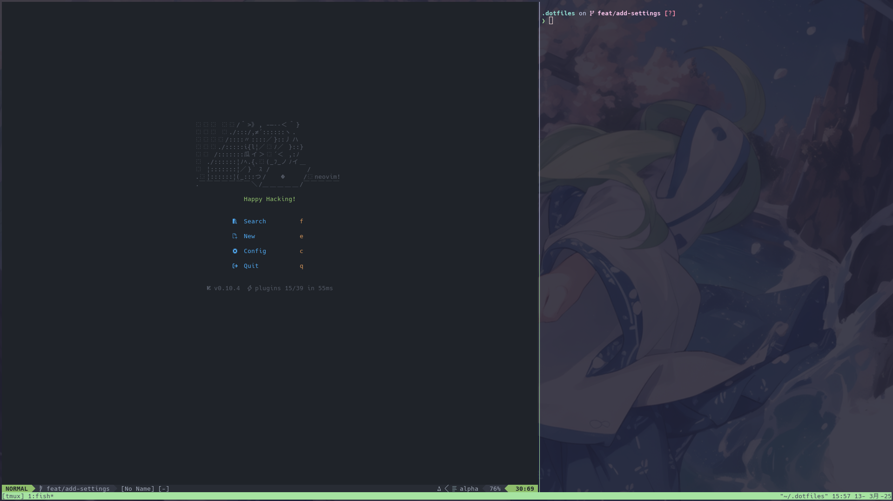

<div align=center>

# **Dotfiles**

**✨️ My personal settings**



</div>

## 🔧 **Stack**

- Arch Linux
- fish
- Neovim
- and more ...

## ⬆️ **How to use**

### 🚀 **Install**

```bash
git clone https://github.com/aqyuki/dotfiles.git ~/.dotfiles
cd ~/.dotfiles
./install.sh install
```

### ✨️ **Apply changes**

```bash
git pull
./install.sh install

# if you want to only sync the packages
# ./install.sh sync
```

### 🔥 **Uninstall**

```bash
./install.sh uninstall
```

## 📜 **License**

[MIT](License.txt)
